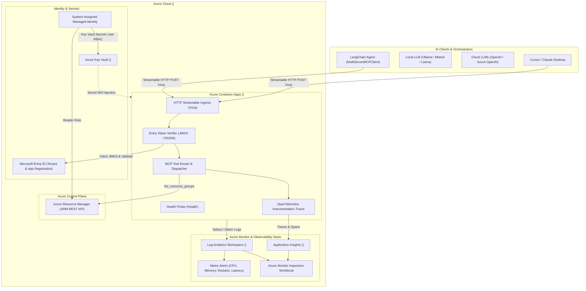

# Azure Remote MCP Server


A production-grade, cloud-native **Model Context Protocol (MCP)** server deployed remotely on **Azure Container Apps** with **Azure Key Vault** secret management, **Microsoft Entra ID** OAuth2/JWT authentication, **OpenTelemetry distributed tracing** to Application Insights, and native integration with **LangChain**, local LLMs (**Ollama**), and cloud agents.

---

## 📑 Table of Contents

- [Overview](#-overview)
- [Architecture](#️-architecture)
- [Key Features](#-key-features)
- [Project Structure](#-project-structure)
- [Available MCP Tools](#-available-mcp-tools)
- [Configuration & Environment Variables](#-configuration--environment-variables)
- [Local Development](#-local-development)
  - [Prerequisites](#prerequisites)
  - [Quickstart Setup](#quickstart-setup)
  - [Testing & Linting](#testing--linting)
  - [Local Health & Endpoint Verification](#local-health--endpoint-verification)
- [Docker & Containerization](#-docker--containerization)
- [Azure Cloud Infrastructure (IaC with Bicep)](#-azure-cloud-infrastructure-iac-with-bicep)
  - [1. Infrastructure Provisioning](#1-infrastructure-provisioning)
  - [2. Image Build & Container App Deployment](#2-image-build--container-app-deployment)
- [Azure Key Vault Secret Management](#-azure-key-vault-secret-management)
- [Observability, Azure Monitor & Live Inspection](#-observability-azure-monitor--live-inspection)
  - [Monitoring Infrastructure & Metrics Alerts](#monitoring-infrastructure--metrics-alerts)
  - [Real-Time Inspection CLI (`inspect.ps1`)](#real-time-inspection-cli-inspectps1)
- [Microsoft Entra ID Authentication Setup](#-microsoft-entra-id-authentication-setup)
- [Client Integration Guides](#-client-integration-guides)
  - [LangChain with Local Ollama](#langchain-with-local-ollama)
  - [Claude Desktop / Cursor Configuration](#claude-desktop--cursor-configuration)
- [CI/CD Automation (GitHub Actions)](#-cicd-automation-github-actions)
- [License](#-license)

---

## 🌟 Overview

The **Azure Remote MCP Server** bridges standard AI agents and LLMs with secure, cloud-hosted remote tools. Operating over the official **Model Context Protocol HTTP Streamable Transport** (`/mcp`), this server is engineered for mission-critical enterprise workloads:

- **Isolated & Scalable**: Runs on serverless **Azure Container Apps** with automatic scaling, ingress management, and health probes (`/health`).
- **Zero-Trust Security**: Validates **Microsoft Entra ID** Bearer tokens against live JWKS endpoints, checking signatures, audiences, issuers, and OAuth2 scopes or application roles.
- **Secret Zero-Exposure**: Sensitive configuration (connection strings, subscription IDs, tenant IDs) resides in **Azure Key Vault** and is securely mounted into container environment variables using System-Assigned Managed Identity.
- **Full Observability**: Automatically instruments every tool execution with **OpenTelemetry spans** and exports traces, exceptions, and execution metrics to **Azure Application Insights** and **Log Analytics**.

---

## 🏛️ Architecture



---

## 🚀 Key Features

- **MCP 2.0 Standard Compliance**: Implements the Model Context Protocol HTTP streamable transport (`stateless_http=True`, `json_response=True`) at the `/mcp` route.
- **Dual Authentication Modes**:
  - *Local / Dev Mode*: Runs unauthenticated when Entra variables are omitted.
  - *Enterprise Mode*: Enforces strict JWT verification using Microsoft Entra ID JWKS, audience validation (`<client_id>` and `api://<client_id>`), issuer checking, and scope/role verification (`mcp:read` / `access_as_user`).
- **Native Azure Key Vault Secret Injection**: Eliminates hardcoded credentials. Secrets are stored in Key Vault and bound directly to Container App environment variables via Managed Identity (`Key Vault Secrets User`).
- **OpenTelemetry & Azure Monitor APM**: Automated distributed tracing around every tool execution (`mcp.tool.<name>`) tracking duration, execution parameters, exceptions, and sending telemetry directly to Application Insights.
- **Azure Resource Manager (ARM) Integration**: Built-in tool using `DefaultAzureCredential` to query Azure Resource Groups.
- **Enterprise Observability Suite**:
  - Modular Bicep IaC for alerts on container CPU (>80%), Memory (>80%), Replicas Restarts (>2), and Latency (>2000ms).
  - Pre-built **Azure Monitor Workbook** visualizing tool execution counts and latency.
  - Interactive PowerShell live inspector (`inspect.ps1`) supporting real-time health checks, Log Analytics error filtering, and live log tailing.
- **Dynamic LangChain Integration**: Seamlessly binds with LangChain's `MultiServerMCPClient` to query tools dynamically at runtime and execute them through Ollama, Mistral, Llama, or cloud models.
- **Multi-Stage Distroless Docker Image**: Hardened, non-root `python:3.11-slim` image with layer caching and integrated healthcheck probes.
- **GitHub Actions CI/CD**: Automated pipeline running pytest, ruff lint checks, OIDC Azure login, container build, and deployment to Azure Container Registry (ACR).

---

## 📂 Project Structure

```
azure-mcp-server/
├── .github/
│   └── workflows/
│       └── deploy.yml              # CI/CD: Lint, test, OIDC login, Docker build & push
├── infra/
│   └── bicep/
│       ├── main.bicep               # Root deployment template
│       ├── deploy-app.bicep         # Standalone Container App & ACR configuration
│       ├── deploy-monitoring.bicep  # Observability deployment (App Insights, Alerts, Workbook)
│       └── modules/
│           ├── acr.bicep            # Azure Container Registry module
│           ├── alerts.bicep         # Azure Monitor metric alert rules
│           ├── app-insights.bicep   # Application Insights component
│           ├── container-app.bicep  # Container App definition with probes
│           ├── container-app-env.bicep # Managed Environment definition
│           ├── diagnostic-settings.bicep # Diagnostic settings for Log Analytics
│           ├── keyvault.bicep       # Azure Key Vault with RBAC
│           ├── loganalytics.bicep   # Log Analytics workspace
│           ├── subscription-role.bicep # Subscription-level Reader RBAC assignment
│           └── workbook.bicep       # Azure Monitor visual inspection dashboard
├── scripts/
│   ├── build.ps1                   # Builds versioned Docker image for ACR
│   ├── deploy.ps1                  # Pushes image to ACR and updates Container App
│   ├── deploy-keyvault.ps1         # Configures Key Vault, Managed Identity RBAC, and secret references
│   ├── deploy-monitoring.ps1       # Provisions Application Insights, Alerts, and Workbook
│   ├── inspect.ps1                 # CLI tool for live health, logs, alerts, and metrics
│   └── test.ps1                    # Cross-platform runner for pytest suite
├── src/
│   └── azure_mcp_server/
│       ├── auth/
│       │   ├── __init__.py
│       │   └── entra.py            # EntraTokenVerifier (JWKS, audience, scopes)
│       ├── core/
│       │   ├── __init__.py
│       │   ├── config.py           # Pydantic Settings & environment variable definitions
│       │   ├── logging.py          # Structlog structured JSON/console logging
│       │   └── telemetry.py        # OpenTelemetry & Azure Monitor tracing decorators
│       ├── mcp/
│       │   ├── __init__.py
│       │   ├── server.py           # MCPServer factory, /health route, and tool registration
│       │   └── tools/
│       │       ├── __init__.py
│       │       ├── azure_resources.py # Azure Resource Manager tools
│       │       ├── calculator.py   # Math tools: add, subtract, multiply, divide
│       │       └── text.py         # Text analytics tools: analyze_text
│       ├── services/
│       │   ├── __init__.py
│       │   └── azure_resource_service.py # Azure SDK wrapper for ARM queries
│       ├── __init__.py
│       └── main.py                 # Application entry point (Streamable HTTP on port 8000)
├── tests/
│   ├── conftest.py                 # Pytest fixtures and mocks
│   ├── test_azure_resource_service.py # Tests for ARM service wrapper
│   ├── test_calculator.py          # Tests for mathematical tools
│   ├── test_entra_auth.py           # Tests for Microsoft Entra token validation
│   ├── test_health.py              # Tests for /health endpoint
│   ├── test_telemetry.py           # Tests for OpenTelemetry spans and decorators
│   └── test_text.py                # Tests for analyze_text tool
├── .dockerignore
├── .editorconfig
├── .env.example                    # Template environment variables
├── Dockerfile                      # Production multi-stage Docker build
├── docker-compose.yml              # Local container orchestration
├── pyproject.toml                  # Project packaging, dependencies, ruff & pytest configuration
├── requirements.txt                # Pinned production requirements
└── uv.lock                         # Fast deterministic lockfile
```

---

## 🧰 Available MCP Tools

The server comes equipped with built-in tools out of the box:

| Tool Name | Parameters | Return Type | Description |
| :--- | :--- | :--- | :--- |
| `add` | `a: float`, `b: float` | `float` | Adds two numbers together. |
| `subtract` | `a: float`, `b: float` | `float` | Subtracts `b` from `a`. |
| `multiply` | `a: float`, `b: float` | `float` | Multiplies two numbers together. |
| `divide` | `a: float`, `b: float` | `float` | Divides `a` by `b`. Throws error if `b == 0`. |
| `analyze_text` | `text: str` | `dict` | Returns `word_count`, `character_count`, and `sentence_count`. Rejects text over 100,000 chars. |
| `list_resource_groups` | *None* | `list[dict]` | Queries Azure Resource Management for resource groups in the configured subscription using `DefaultAzureCredential`. |

---

## ⚙️ Configuration & Environment Variables

The server uses Pydantic Settings ([`src/azure_mcp_server/core/config.py`](file:///c:/Users/User/Projects/Gen%20AI/azure-mcp-server/src/azure_mcp_server/core/config.py)). Values can be provided via `.env` file, environment variables, or Azure Key Vault secret references.

| Variable | Description | Source / Key Vault Secret | Default | Required |
| :--- | :--- | :--- | :--- | :---: |
| `APP_NAME` | Identifier for the MCP server | Environment | `azure-remote-mcp-server` | No |
| `HOST` | Bind host address | Environment | `0.0.0.0` | No |
| `PORT` | Bind port number | Environment | `8000` | No |
| `LOG_LEVEL` | Logging level (`DEBUG`, `INFO`, `WARNING`, `ERROR`) | Environment | `INFO` | No |
| `APPLICATIONINSIGHTS_CONNECTION_STRING` | Azure Application Insights connection string | Key Vault (`appinsights-connection-string`) | `None` | Optional |
| `AZURE_SUBSCRIPTION_ID` | Azure Subscription ID for ARM tools | Key Vault (`azure-subscription-id`) | `None` | Optional |
| `ENTRA_TENANT_ID` | Microsoft Entra Tenant ID (set to enable JWT auth) | Key Vault (`entra-tenant-id`) | `None` | Optional |
| `ENTRA_CLIENT_ID` | Microsoft Entra App Client ID (expected audience) | Key Vault (`entra-client-id`) | `None` | Optional |
| `REQUIRED_SCOPE` | Expected OAuth2 scope or App Role | Environment | `mcp:read` | No |
| `MCP_RESOURCE_URL` | Canonical public endpoint for the MCP server | Environment | `http://localhost:8000/mcp` | No |

> [!NOTE]
> When `ENTRA_TENANT_ID` and `ENTRA_CLIENT_ID` are omitted or left blank, the server automatically operates in **unauthenticated development mode**, making it easy to test locally or behind a secure private network.

---

## 🏃 Local Development

### Prerequisites

- **Python 3.11+**
- **uv** (recommended for ultra-fast environment management) or standard `pip`
- **Docker** (optional, for local container testing)
- **Azure CLI (`az`)** (optional, for ARM resource tools)

### Quickstart Setup

1. **Clone the repository**:
   ```bash
   git clone https://github.com/<your-org>/<your-repo>.git
   cd <your-repo>
   ```

2. **Create virtual environment and install dependencies**:
   ```bash
   # Using uv (recommended)
   uv sync --extra dev

   # Or using standard pip
   python -m venv .venv
   source .venv/bin/activate  # On Windows: .venv\Scripts\Activate.ps1
   pip install -e ".[dev]"
   ```

3. **Configure environment**:
   ```bash
   cp .env.example .env
   ```
   For unauthenticated local testing, the default values in `.env.example` work out of the box.

4. **Start the server**:
   ```bash
   uv run python -m azure_mcp_server.main
   ```
   The server listens on `http://0.0.0.0:8000`.

### Testing & Linting

Run the test suite and code style checks:

```powershell
# Run unit tests via pytest
uv run pytest -v

# Run Ruff linter
uv run ruff check .

# Or run via PowerShell script
.\scripts\test.ps1
```

### Local Health & Endpoint Verification

Verify the server is healthy:

```bash
# Health check probe
curl http://localhost:8000/health
# Response: {"status":"healthy"}
```

---

## 🐳 Docker & Containerization

### Build & Run via Docker CLI

```bash
# Build the Docker image
docker build -t azure-mcp-server:latest .

# Run container locally with .env configuration
docker run -d \
  --name azure-mcp-server \
  -p 8000:8000 \
  --env-file .env \
  azure-mcp-server:latest

# Check logs
docker logs -f azure-mcp-server
```

### Run via Docker Compose

```bash
docker compose up -d
docker compose logs -f
```

---

## ☁️ Azure Cloud Infrastructure (IaC with Bicep)

The project includes modular Bicep templates in [`infra/bicep/`](file:///c:/Users/User/Projects/Gen%20AI/azure-mcp-server/infra/bicep).

### 1. Infrastructure Provisioning

Deploy the full Azure environment (Container Registry, Log Analytics, Application Insights, Container App Environment, and Container App):

```powershell
az deployment group create `
    --resource-group "<your-resource-group>" `
    --template-file infra/bicep/main.bicep `
    --parameters acrName="<your-acr-name>" `
                 logAnalyticsName="<your-log-analytics-name>" `
                 containerEnvironmentName="<your-env-name>" `
                 containerAppName="<your-container-app-name>" `
                 assignSubscriptionReaderRole=true
```

### 2. Image Build & Container App Deployment

Build and push the container image to Azure Container Registry (ACR) and update the Container App:

```powershell
# Set ACR and deployment target variables
$env:ACR_NAME = "<your-acr-name>"
$env:RESOURCE_GROUP = "<your-resource-group>"
$env:CONTAINER_APP_NAME = "<your-container-app-name>"

# Build image locally and tag for ACR
.\scripts\build.ps1

# Push to ACR and roll out new revision to Container App
.\scripts\deploy.ps1
```

---

## 🔐 Azure Key Vault Secret Management

Rather than passing raw credentials as plain-text environment variables, the server pulls secrets from **Azure Key Vault** via **System-Assigned Managed Identity**.

### Automated Key Vault Setup Script

Run the automated PowerShell provisioning script:

```powershell
.\scripts\deploy-keyvault.ps1 `
    -ResourceGroup "<your-resource-group>" `
    -KeyVaultName "<your-keyvault-name>" `
    -ContainerAppName "<your-container-app-name>" `
    -Location "<your-region>"
```

### What this script automates:

1. **Provisions Key Vault**: Creates the Azure Key Vault with Azure RBAC authorization enabled.
2. **Assigns RBAC**: Grants the Container App's System-Assigned Managed Identity the **Key Vault Secrets User** role.
3. **Injects Secret References**: Configures Azure Container App secret references pointing directly to Key Vault:
   - `appinsights-cs` &rarr; `keyvaultref:https://<your-keyvault-name>.vault.azure.net/secrets/appinsights-connection-string,identityref:system`
   - `azure-sub-id` &rarr; `keyvaultref:https://<your-keyvault-name>.vault.azure.net/secrets/azure-subscription-id,identityref:system`
   - `entra-tenant-id` &rarr; `keyvaultref:https://<your-keyvault-name>.vault.azure.net/secrets/entra-tenant-id,identityref:system`
   - `entra-client-id` &rarr; `keyvaultref:https://<your-keyvault-name>.vault.azure.net/secrets/entra-client-id,identityref:system`
4. **Binds Environment Variables**: Links `APPLICATIONINSIGHTS_CONNECTION_STRING`, `AZURE_SUBSCRIPTION_ID`, `ENTRA_TENANT_ID`, and `ENTRA_CLIENT_ID` to their respective `secretref:*` definitions.

---

## 🔍 Observability, Azure Monitor & Live Inspection

The remote server includes an enterprise observability stack designed for production operations.

### Monitoring Infrastructure & Metrics Alerts

Deploy Application Insights, Metric Alerts, Log Analytics Diagnostic Settings, and the Inspection Workbook:

```powershell
.\scripts\deploy-monitoring.ps1 `
    -ResourceGroup "<your-resource-group>" `
    -ContainerAppName "<your-container-app-name>" `
    -AppInsightsName "<your-appinsights-name>"
```

Proactive Metric Alerts provisioned:
- **High CPU Alert**: Triggers when container CPU usage exceeds 80%.
- **High Memory Alert**: Triggers when container memory usage exceeds 80%.
- **Container Restart Alert**: Triggers when replica restart count exceeds 2 within a 5-minute window.
- **High Latency Alert**: Triggers when request duration exceeds 2000ms.

### Real-Time Inspection CLI (`inspect.ps1`)

The [`scripts/inspect.ps1`](file:///c:/Users/User/Projects/Gen%20AI/azure-mcp-server/scripts/inspect.ps1) script provides an end-to-end operational diagnostic dashboard right in your terminal:

```powershell
# 1. Full health check & deployment inspection
.\scripts\inspect.ps1

# 2. Check for recent errors in Log Analytics
.\scripts\inspect.ps1 -ErrorsOnly

# 3. Stream live container logs in real time
.\scripts\inspect.ps1 -Tail

# 4. View a specific number of recent log entries
.\scripts\inspect.ps1 -LogLines 50
```

#### Inspection Capabilities:
- ✅ **Container Status**: Provisioning state, replica count, current image tag, and active revision.
- ⚡ **Live HTTP Latency Probe**: Measures round-trip latency to the `/health` endpoint.
- 📊 **Application Insights Telemetry**: Direct portal links to Live Metrics (QuickPulse) and Failures blades.
- 🚨 **Azure Monitor Alerts**: Displays configured alert rules, severity, and enabled states.
- 📋 **Log Analytics Queries**: Queries and color-codes console and system logs.
- 📈 **Azure Monitor Workbook**: Direct link to the custom MCP telemetry dashboard.

---

## 🛡️ Microsoft Entra ID Authentication Setup

When enabling authentication in production:

1. **Register an Application in Microsoft Entra ID**:
   - Go to **Azure Portal** &rarr; **Microsoft Entra ID** &rarr; **App registrations** &rarr; **New registration**.
   - Name: `Azure Remote MCP Server`.

2. **Expose an API**:
   - Under **Expose an API**, set the Application ID URI (e.g., `api://<your-client-id>`).
   - Add a scope:
     - Scope name: `mcp:read` (or `access_as_user`)
     - Who can consent: Admins and users
     - Display name: `Read access to MCP tools`

3. **Configure the Container App**:
   - Store the Tenant ID and Client ID in Key Vault (`entra-tenant-id`, `entra-client-id`).
   - The server validates:
     - Issuer: `https://login.microsoftonline.com/<your-tenant-id>/v2.0`
     - Audience: `<your-client-id>` or `api://<your-client-id>`
     - Scope: `mcp:read` in the token's `scp` claim or `roles` claim.

---

## 🔌 Client Integration Guides

### LangChain with Local Ollama

LangChain connects dynamically using `MultiServerMCPClient` from `langchain-mcp-adapters`:

#### 1. Install Client Libraries
```powershell
uv pip install langchain-ollama langchain-mcp-adapters azure-identity
```

#### 2. Client Script (`client.py`)

```python
import asyncio
from azure.identity import AzureCliCredential
from langchain_ollama import ChatOllama
from langchain_mcp_adapters.client import MultiServerMCPClient

# Dummy remote endpoint and client ID placeholders
MCP_URL = "https://<your-container-app>.<your-region>.azurecontainerapps.io/mcp"
ENTRA_CLIENT_ID = "<your-client-id>"

def get_auth_headers():
    """Acquires a Bearer token via Azure CLI if authentication is enabled."""
    try:
        credential = AzureCliCredential()
        token = credential.get_token(f"api://{ENTRA_CLIENT_ID}/.default")
        return {"Authorization": f"Bearer {token.token}"}
    except Exception:
        # Fall back to unauthenticated if Entra is not enforced
        return {}

async def main():
    headers = get_auth_headers()
    
    # 1. Connect to Azure Remote MCP Server
    client = MultiServerMCPClient({
        "azure_mcp": {
            "url": MCP_URL,
            "transport": "http",
            "headers": headers,
        }
    })

    # 2. Discover tools dynamically from Azure
    tools = await client.get_tools()
    print("Discovered MCP Tools:", [t.name for t in tools])

    # 3. Bind tools to a model (e.g. mistral, llama3.1, qwen2.5)
    llm = ChatOllama(model="mistral:latest", temperature=0).bind_tools(tools)

    # 4. Invoke LLM
    messages = [
        ("system", "You are an assistant. Always use tools for math, text analysis, and Azure resources."),
        ("human", "Calculate 4856 multiplied by 1246565656, and analyze the text 'Production MCP on Azure is awesome!'")
    ]
    response = await llm.ainvoke(messages)

    # 5. Execute tools returned by LLM
    if response.tool_calls:
        tools_map = {t.name: t for t in tools}
        for call in response.tool_calls:
            print(f"\n-> Calling tool '{call['name']}' with args: {call['args']}")
            result = await tools_map[call["name"]].ainvoke(call["args"])
            print(f"<- Result from Azure: {result}")
    else:
        print(f"AI: {response.content}")

if __name__ == "__main__":
    asyncio.run(main())
```

---

### Claude Desktop / Cursor Configuration

To configure the remote server in desktop clients supporting MCP over HTTP / SSE:

```json
{
  "mcpServers": {
    "azure-mcp-server": {
      "url": "https://<your-container-app>.<your-region>.azurecontainerapps.io/mcp",
      "transport": "http",
      "headers": {
        "Authorization": "Bearer <YOUR_ENTRA_ACCESS_TOKEN>"
      }
    }
  }
}
```

---

## 🔄 CI/CD Automation (GitHub Actions)

The repository includes a GitHub Actions workflow in [`.github/workflows/deploy.yml`](file:///c:/Users/User/Projects/Gen%20AI/azure-mcp-server/.github/workflows/deploy.yml).

### Pipeline Stages:
1. **Lint & Test**: Sets up Python 3.11, installs dev dependencies, runs `ruff check .`, and runs `pytest -v`.
2. **Azure OIDC Authentication**: Authenticates securely to Azure without long-lived client secrets using OpenID Connect (OIDC).
3. **Build & Push to ACR**: Retrieves an ephemeral ACR access token (`az acr login --expose-token`), builds the Docker container, and pushes it with the Git commit SHA and `latest` tags.
4. **Deploy to Container App**: Updates the Azure Container App image reference, triggering a zero-downtime rolling revision update.

### Required GitHub Secrets:

Configure these in **GitHub Repository** &rarr; **Settings** &rarr; **Secrets and variables** &rarr; **Actions**:

| Secret Name | Description | Example Placeholder |
| :--- | :--- | :--- |
| `AZURE_CLIENT_ID` | App Registration Client ID with Federated Credential | `<your-client-id>` |
| `AZURE_TENANT_ID` | Azure Entra Tenant ID | `<your-tenant-id>` |
| `AZURE_SUBSCRIPTION_ID` | Azure Subscription ID | `<your-subscription-id>` |
| `ACR_NAME` | Name of your Azure Container Registry | `<your-acr-name>` |
| `RESOURCE_GROUP` | Resource Group where Container App is deployed | `<your-resource-group>` |
| `CONTAINER_APP_NAME` | Name of the Azure Container App | `<your-container-app-name>` |

---

## 📄 License

This project is licensed under the MIT License. See the [LICENSE](LICENSE) file for details.
